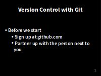
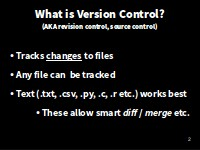
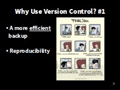
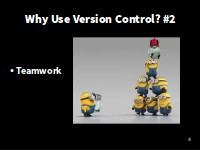
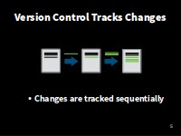
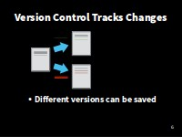
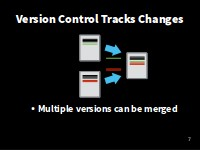
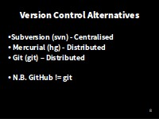

## Topics

0.  [Introduction](index.html)
1.  [Setting Up Git](01-setup.html)
2.  [Creating a Repository](02-create.html)
3.  [Tracking Changes](03-changes.html)
4.  [Exploring History](04-history.html)
5.  [Ignoring Things](05-ignore.html)
6.  [Collaborating](06-collab.html)
7.  [Conflicts](07-conflict.html)

> ## Learning Objectives {.objectives}
>
> *   Understand when version control is useful and how it works

**START**

## What is Version Control & Why should I use it? ##

Version control tools, also known as **revision control** or **source control** tools, track **changes** to files.  

### 1. A More Efficient Backup ###

We've all been in this situation before - it seems ridiculous to have multiple nearly-identical versions of the same document. Some word processors let us deal with this a little better, like Microsoft Word ("Track Changes") or Google Docs version history.

BUT research isn't just Words docs.  With **Version Control**, at any point in the future, you can retrieve the **correct versions** of your documents, scripts or code.  So, for example, a year after publication, you can get hold of the precise combination of scripts and data that you used to assemble a paper.  

Version control makes **reproducibility** simpler. If you're not using version control can you honestly say that your research is reproducible?

### 2. A Collaboration Tool ###

As well as maintaining a revison history, VC tools also help multiple authors collaborate on the **same file** or set of files.

VC is what **professional software developers** use to work in large **teams** and to keep track of what they've done.  They know who has changed what and when.  And who to blame when things break!

Every large software development project relies on VC, and most programmers use it for their small jobs as well.

**VC isn't just for software**: papers, small data sets, and anything that changes over time, or needs to be shared can, and probably should be stored in a version control system.

We'll look at both the backup and collaboration scenarios, but first it's useful to understand what going on under the hood.

### 3. How do Version Control Tools Work? ###

---------------------------------------------------------------

**Version control systems start by storing the base version** of the file that you save and then **store just the changes** you made at each step on the way. You can think of it as a tape: if you rewind the tape and **start** at the base document, then you can **play back** each change and end up with your latest version.

---------------------------------------------------------------

Once you think of **changes as separate from the document** itself, you can then think about "playing back" different sets of changes onto the base document and getting different versions of the document. For example, **two users can make independent sets of changes** based on the same document.

---------------------------------------------------------------

If there aren't conflicts, you can even try to play two sets of changes onto the same base document.  A process call **merging**.

---------------------------------------------------------------
## 3. Version Control Alternatives ##

These are the most popular current Version Control systems.  

**Subversion** has been around since about 2000, it was developed to replace the venerable **Concurrent Versioning System (CVS)** It introduced such revolutionary concepts as the ability to move and rename files whilst retaining their version history.

Both **Mercurial** and **Git** arose from the need to find a new Version Control System for the Linux Kernel, after BitKeeper became non-free in 2005. 

Whereas with **Subversion** a single master copy of the repository (the files under version control) exists - the only place where all revision history is kept,  **Mercurial** and **Git** are newer and work a little differently - they are **Distributed** Version control systems - each developer in a team has his own copy of the repository which are then synchronised.  You can use Git without a network connection and there's no single point of failuire.

**Git** was written by Linus Torvalds (maintainer of the Linux kernel), to scratch his own itch, so if you think it's idiosyncractic in places, you know who to blame.

Git has found wider prominence partly through the rise of **GitHub** - a web based Git repository hosting service.  GitHub also provide bells and whistles like **bug tracking**, **task management** and other tools for managing software projects.

You don't **need** to use GitHub to employ Git, but we will use it today to demonstrate the use of remote repositories.

## Other Resources

* [Overview](version-control-with-git-slides.odp)
* [Glossary Reference](reference.html)

[Next -  Setting Up Git ](01-setup.html)
